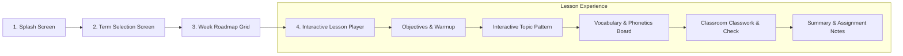

# Implementation Plan: Lang Huey Primary 4 French Android App (`P4_FRENCH`) — Term 1 Full Build

## Overview & Execution Strategy
We are building the complete **Grade 4 / Primary 4 French Language Standalone Android App (`P4_FRENCH`)** targeting Android Smartboards and Interactive Flat Panels using **Flutter & Dart**.

### Strict Operational Principles:
1. **Term-by-Term Sequential Delivery**: Build **Term 1 (Weeks 1–13)** completely at a stretch with 100% curriculum fidelity before starting subsequent terms.
2. **Logic & UI First (Zero External Media Blockers)**:
   - Build all interactive mechanics, widgets, screen flows, vocabulary datasets, and evaluation checklists using clean Flutter widgets, vector shapes, typography, and theme styling.
   - Audio and illustration asset integration will be handled in a dedicated multimedia phase after the complete app logic is finished and validated.
3. **Smartboard Immersion (No Teacher Cue Clutter)**:
   - No on-screen teacher cue bar. The interface is 100% student-facing with large touch ergonomics, high contrast, and landscape layout.
4. **No In-App Computerized Exams**:
   - Week 5 (Mid-Term) and Week 11/12 (Revision/Wrap-up) provide interactive classroom review recaps and oral check boards. Formal exams remain on paper via the Teacher's Manual.

---

## Term 1 Week-by-Week Content & Interactive Pattern Mapping

Every week in Term 1 is mapped directly from [PRIMARY_4_FRENCH_LANGUAGE_LESSON_NOTES.md](file:///c:/Users/DELL/Desktop/Lang%20Huey/scheme%20of%20work%20files/PRIMARY_4_FRENCH_LANGUAGE_LESSON_NOTES.md):

```
Term 1 Structure:
├── Week 1: Pourquoi apprendre le français? (Why learn French?)
│   ├── Pattern: Interactive Africa & Nigeria Border Map + Alphabet Soundboard (A-E)
│   ├── Objectives, Subtopics, Evaluation (5 questions), Assignment
├── Week 2: Saluer (Greetings) - Part 1
│   ├── Pattern: Time-of-Day Context Dial (Morning/Evening/Night) + Formal/Informal Switch
│   ├── Objectives, Subtopics (Bonjour, Bonsoir, Bonne nuit, Salut, Ça va?), Evaluation, Assignment
├── Week 3: Saluer (Greetings) - Part 2
│   ├── Pattern: "Les Mots Magiques" Courtesy Chest + "La Bise" Cultural Showcase
│   ├── Objectives, Subtopics (Au revoir, À bientôt, À demain, S'il vous plaît, Merci, Pardon), Evaluation, Assignment
├── Week 4: Se présenter (Introducing Oneself) - Part 1
│   ├── Pattern: Personal Identity Sentence Lab (Je m'appelle, Je suis, Nigérian/e, Pronouns)
│   ├── Objectives, Subtopics, Evaluation, Assignment
├── Week 5: Mid-Term Interactive Review & Recap (Weeks 1-4 Oral & Visual Check)
├── Week 6: Mid-Term Break (Rest Screen)
├── Week 7: Se présenter (Age & Gender) - Part 2
│   ├── Pattern: French Number Counter (1-20) + Age & Avatar Selector (J'ai ... ans, Garçon/Fille)
│   ├── Objectives, Subtopics, Evaluation, Assignment
├── Week 8: Prendre congé (Taking Leave) - Part 1
│   ├── Pattern: Farewell Context Clock & Calendar Matcher (À tout à l'heure, À ce soir, Bon week-end)
│   ├── Objectives, Subtopics, Evaluation, Assignment
├── Week 9: Prendre congé (Taking Leave) - Part 2
│   ├── Pattern: Gratitude & Departure Conversation Flow Builder (Merci beaucoup, Dialogue builder)
│   ├── Objectives, Subtopics, Evaluation, Assignment
├── Week 10: Review & Integration: Identity Theme
│   ├── Pattern: "Carte d'Identité Scolaire" Workshop & Classroom Presentation Podium
│   ├── Objectives, Subtopics, Evaluation, Assignment
├── Week 11: Term 1 Comprehensive Interactive Revision Rally
└── Week 12 & 13: Term 1 Completion & Vacation Screen
```

---

## App Flow & Screen Navigation



---

## Technical Architecture (Flutter Standalone App)

```
mvp/lib/  (Target production structure for P4 French)
├── main.dart                          # App entry point, landscape enforcement, theme init
├── app.dart                           # MaterialApp, custom page transitions, routes
├── theme/
│   ├── app_colors.dart                # Deep Teal (#0D7377), Turquoise (#14BDCC), Cream (#F5F0E8), Charcoal (#1C1C1C), Gold (#F4A832)
│   └── app_typography.dart            # Nunito Bold headlines & Inter body styles
├── models/
│   ├── term_model.dart                # Term metadata
│   ├── week_lesson_model.dart         # Full week lesson schema (Objectives, Topic, Content, Classwork, Evaluation, Assignment)
│   └── interactive_step_model.dart    # Steps inside a lesson
├── data/
│   └── term1_lessons_data.dart        # 100% complete Term 1 curriculum dataset (Weeks 1 to 13)
├── screens/
│   ├── splash/splash_screen.dart      # Clean animated splash screen
│   ├── term/term_select_screen.dart   # Term 1, 2, 3 selection cards
│   ├── roadmap/week_roadmap_screen.dart# Visual 13-week timeline for selected term
│   └── lesson/lesson_player_screen.dart # Interactive lesson orchestrator
└── widgets/
    ├── common/
    │   ├── smartboard_header.dart     # Term/Week title, lesson phase stepper, back button
    │   ├── smartboard_button.dart     # Touch-target >= 56px interactive buttons
    │   └── audio_trigger_chip.dart    # Clean visual pronunciation badge
    └── patterns/                      # Topic-specific pedagogical widgets
        ├── map_explorer_widget.dart   # Week 1: Nigeria border & Francophone countries
        ├── alphabet_soundboard_widget.dart # Week 1: French alphabet A-E phonetics
        ├── greeting_dial_widget.dart  # Week 2: Time-of-day & formal/informal greetings
        ├── magic_words_widget.dart    # Week 3: Polite expressions & La bise culture
        ├── identity_builder_widget.dart # Week 4: Name, nationality & pronouns
        ├── number_counter_widget.dart # Week 7: Numbers 1-20 & age/gender
        ├── farewell_matcher_widget.dart # Week 8: Parting expressions & situation cards
        ├── dialogue_sequencer_widget.dart # Week 9: Conversation flow builder
        ├── id_card_workshop_widget.dart # Week 10: "Carte d'Identité" generator & podium
        └── revision_rally_widget.dart # Week 11: Interactive revision checkpoint
```

---

## Verification & Testing Plan

1. **Orientation & Layout Ergonomics**:
   - Verify landscape lock on Android.
   - Test touch interactivity and layout scaling on 1080p and 4K viewports.
2. **Curriculum Completeness**:
   - Check every single question in the Evaluation and Assignment against `PRIMARY_4_FRENCH_LANGUAGE_LESSON_NOTES.md` for Term 1.
3. **Execution Quality**:
   - Run `flutter analyze` and `flutter test` to ensure zero compilation errors and smooth 60fps widget performance.
