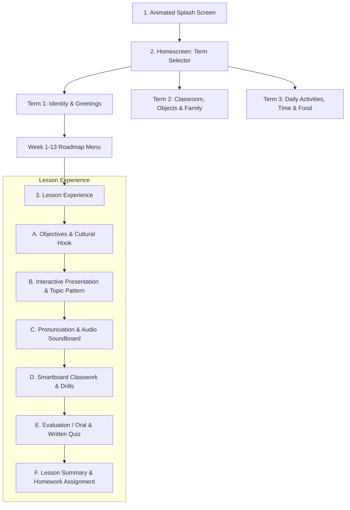

# Implementation Plan: Lang Huey Primary 4 French Standalone App (`P4_FRENCH`)

## Overview & Strategic Direction
We are building the first complete, standalone classroom smartboard application for **Grade 4 / Primary 4 French Language** (`P4_FRENCH`). 
The application will fully digitize and gamify the government-approved NERDC Nigerian Primary 4 French Curriculum (Terms 1, 2, and 3) from [PRIMARY_4_FRENCH_LANGUAGE_LESSON_NOTES.md](file:///c:/Users/DELL/Desktop/Lang%20Huey/scheme%20of%20work%20files/PRIMARY_4_FRENCH_LANGUAGE_LESSON_NOTES.md).

### Core Architectural Decisions & Upgrades
1. **Curriculum Completeness**: Zero details skipped. Every week, topic, subtopic breakdown, vocabulary item, phonetic pronunciation, evaluation quiz, assignment, and roleplay activity is integrated.
2. **Topic-Specific Interactive Learning Patterns**: Rather than a static generic flashcard player, each topic receives a tailored interactive mechanic matched to its pedagogy:
   - **Week 1 (Why Learn French & Geography)**: Interactive Africa & Nigeria Border Map + French Alphabet Soundboard.
   - **Week 2 (Greetings Pt 1)**: Time-of-Day Interactive Dial (Morning $\rightarrow$ Evening $\rightarrow$ Night) + Formal vs. Informal Dialogue Simulator.
   - **Week 3 (Greetings Pt 2 - Goodbyes & Politeness)**: "Magic Words" (Les Mots Magiques) Interactive Sorting + "La Bise" Cultural Animated Showcase.
   - **Week 4 & 7 (Self-Introduction, Age & Gender)**: Interactive Pupil ID Card Builder ("Carte d'Identité Scolaire") + French Number Counter (1-20).
   - **Week 8 & 9 (Taking Leave & Gratitude)**: Clock/Calendar Destination Matcher + Situational Roleplay Cards.
   - **Week 5 & 12 (Mid-term & Final Assessments)**: Interactive Smartboard Team Quiz Show / Board Exam Challenge (Group A vs Group B).
3. **Smartboard-Only Visual Immersion (Teacher Cue Removed)**:
   - The on-screen Teacher Cue Bar has been removed from the classroom display to avoid distracting students.
   - All teacher guidance, step-by-step lesson pacing, and phonetic scripts will be formatted into a companion **Printable/Digital Teacher's Manual**.
4. **Monorepo / Multi-App Codebase Structure**:
   - Organized in our central production repository under `apps/` (or root module folders):
     ```
     Lang Huey/
     ├── apps/
     │   ├── p4_french/        # Primary 4 French Standalone App
     │   ├── p5_french/        # Primary 5 French Standalone App (Future)
     │   └── p6_chinese/       # Primary 6 Mandarin Standalone App (Future)
     ├── packages/
     │   ├── core_ui/          # Shared smartboard components & theme tokens
     │   ├── audio_engine/     # WebAudio / Speech / Soundboard player
     │   └── curriculum_data/  # Schema & JSON transformers
     ├── website/              # Prelaunch landing page
     └── manuals/              # Companion Teacher Manuals (PDF/HTML)
     ```

---

## Proposed Technical Architecture & Structure for `P4_FRENCH`

### 1. Screen Flow & Navigation


### 2. File & Component Breakdown

```
apps/p4_french/
├── src/
│   ├── assets/
│   │   ├── audio/           # French pronunciation clips & sound effects
│   │   ├── icons/           # SVG icons & vector flags (Benin, Niger, Cameroon, Chad, France)
│   │   └── illustrations/   # Visual flashcards & topic vectors
│   ├── data/
│   │   ├── term1_curriculum.json  # Complete digitized Term 1 (Weeks 1-13)
│   │   ├── term2_curriculum.json  # Complete digitized Term 2 (Weeks 1-13)
│   │   └── term3_curriculum.json  # Complete digitized Term 3 (Weeks 1-13)
│   ├── components/
│   │   ├── common/
│   │   │   ├── HeaderBar.jsx         # Term/Week title, timer, fullscreen toggle
│   │   │   ├── SmartboardButton.jsx  # High-touch target buttons
│   │   │   ├── AudioButton.jsx       # Native pronunciation trigger
│   │   │   └── ProgressBar.jsx       # Section indicator
│   │   ├── patterns/                 # Topic-specific pedagogical widgets
│   │   │   ├── AfricaMapExplorer.jsx # Week 1 Map & Francophone neighbor explorer
│   │   │   ├── AlphabetSoundboard.jsx# French alphabet A-Z phonetics
│   │   │   ├── TimeOfDayDial.jsx     # Morning/Day/Evening/Night greeting switch
│   │   │   ├── DialogueBubbleView.jsx# Comic-style interactive dialogues
│   │   │   ├── MagicWordsSorter.jsx  # Drag/Tap polite words classifier
│   │   │   ├── StudentIdCardBuilder.jsx # "Je m'appelle", age & gender card
│   │   │   ├── NumberCounterGrid.jsx # Numbers 1-20 visual audio counter
│   │   │   └── BoardQuizArena.jsx    # Mid-term/Exam team competition engine
│   │   └── lesson/
│   │       ├── LessonIntroView.jsx
│   │       ├── LessonPresentationView.jsx
│   │       ├── LessonClassworkView.jsx
│   │       ├── LessonEvaluationView.jsx
│   │       └── LessonSummaryView.jsx
│   ├── screens/
│   │   ├── SplashScreen.jsx
│   │   ├── TermSelectScreen.jsx
│   │   ├── WeekSelectScreen.jsx
│   │   └── LessonPlayerScreen.jsx
│   ├── theme/
│   │   ├── colors.js                 # Teal, Turquoise, Cream, Charcoal, Gold
│   │   └── typography.js             # Nunito & Inter font tokens
│   ├── App.jsx
│   └── index.css                     # 100% responsive 4K/1080p smartboard styles
```

---

## Pedagogical Topic Breakdown (Term 1 Sample Pattern Mapping)

| Week | Topic | Unique Interactive Pattern | Classwork / Interactive Activity |
|---|---|---|---|
| **Week 1** | *Pourquoi apprendre le français?* | **Interactive Africa Map + French Alphabet Soundboard** | Neighbor matching: tap border country to hear name & greeting; French vs English alphabet sound explorer. |
| **Week 2** | *Saluer (Greetings) - Part 1* | **Time-of-Day Sun/Moon Dial & Formal/Informal Switch** | Situational greeting selector (8 AM Headteacher vs 4 PM Friend Amina). |
| **Week 3** | *Saluer (Greetings) - Part 2* | **"Magic Words" (Mots Magiques) Box & "La Bise" Cultural Animation** | Magic Word sorting (Polite vs Farewell) + Dialogue roleplay cards. |
| **Week 4** | *Se présenter (Introducing Oneself) - Part 1* | **Interactive French ID Card Maker ("Carte d'Identité")** | Tap name & nationality tiles to assemble sentences: *"Je m'appelle..."*, *"Je suis nigérian(e)"*. |
| **Week 5** | *Mid-Term Examination* | **Smartboard Team Quiz Arena (Group A vs Group B)** | 10-question rapid board quiz covering Weeks 1-4 with sound effects & scorekeeper. |
| **Week 7** | *Se présenter (Age & Gender) - Part 2* | **French Number Soundboard (1-20) & Avatar Selector** | Boy/Girl avatar creator + Age calculator: *"J'ai ... ans"*. |
| **Week 8** | *Prendre congé (Taking Leave) - Part 1* | **Farewell Time-Clock & Calendar Card Matcher** | Match "À demain" to tomorrow, "À ce soir" to tonight, "Bon week-end" to Friday. |
| **Week 9** | *Prendre congé (Taking Leave) - Part 2* | **Gratitude & Departure Comic Strip Dialogue Player** | Roleplay conversation sequencer: Greeting $\rightarrow$ Chat $\rightarrow$ Gratitude $\rightarrow$ Farewell. |
| **Week 10** | *Review & Integration: Identity Theme* | **Class Identity Showcase & Student Intro Booth** | Live smartboard presentation mode with printable student summary cards. |
| **Week 11 & 12** | *Revision & End of Term Exam* | **Comprehensive Multi-Round Board Championship** | Full oral & written assessment simulation. |

---

## Verification & Validation Plan

### 1. Functional Testing
- **Navigation Flow**: Verify seamless transition from Splash $\rightarrow$ Term Selector $\rightarrow$ Week Roadmap $\rightarrow$ Lesson Experience $\rightarrow$ Lesson Summary $\rightarrow$ Return to Roadmap.
- **Topic Patterns**: Test all custom interactive widgets (Map, Soundboards, ID Card Maker, Quiz Arena) on both mouse and touch input.
- **Smartboard Ergonomics**: Verify 4K (3840x2160), 1080p (1920x1080), and landscape tablets; ensure minimum touch target size $\ge 56\text{px}$ for comfortable finger tapping on flat panels.

### 2. Curriculum Fidelity Check
- Cross-reference every subtopic, evaluation question, and assignment against `PRIMARY_4_FRENCH_LANGUAGE_LESSON_NOTES.md` to guarantee 100% curriculum compliance.

### 3. Teacher Manual Separation
- Verify that the smartboard interface contains zero teacher-facing cue clutter, and that teacher instructions are cleanly compiled in the accompanying digital/printable guide.

---

## Suggestions & Open Questions for User Consideration

> [!TIP]
> **Suggestion 1: Team Board Game Mode for Classrooms**
> Smartboards in Nigerian classrooms are most exciting when the class divides into two teams (e.g. "Équipe Bleue" vs "Équipe Verte"). Adding an optional Team Scoreboard toggle on classwork and quizzes increases pupil engagement significantly.

> [!TIP]
> **Suggestion 2: Teacher Manual PDF Generator / Quick Print View**
> Along with the standalone app, we can provide a one-click "Print / Export Teacher Lesson Guide" button in the teacher settings or as a standalone companion HTML/PDF document so teachers can have physical notes in hand.

> [!IMPORTANT]
> **Question 1: Tech Stack Preference for Standalone App Packaging**
> For packaging the standalone app:
> - **Option A (Vite + React / Modern Web App Engine)**: Ultra-fast UI iteration, rich custom CSS/SVG animations, lightweight offline PWA / Electron / Capacitor build for Android Smartboards & Windows PCs.
> - **Option B (Flutter / Dart)**: Native Android APK build.
> Which platform stack do you prefer we use for `apps/p4_french`?
